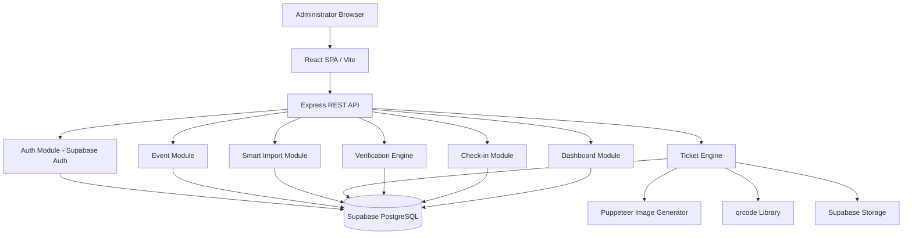

# Architecture Overview — QR Ticket Generation & Verification Platform

## System Design
The application is structured as a **Modular Monolith** pairing a Node.js/Express TypeScript API with a React 18 / Vite TypeScript SPA. Database is Supabase PostgreSQL accessed via Drizzle ORM. Asset storage is Supabase Storage.



## Backend Module Structure
```
server/src/
├── config/
│   ├── env.ts              # Environment configuration
│   └── supabase.ts         # Supabase client initialization
├── db/
│   ├── schema/             # Drizzle ORM schema definitions
│   │   ├── users.ts
│   │   ├── events.ts
│   │   ├── ticket-types.ts
│   │   ├── guests.ts
│   │   ├── tickets.ts
│   │   ├── ticket-checkins.ts
│   │   ├── guest-imports.ts
│   │   └── index.ts
│   ├── migrations/         # Drizzle migration files
│   └── index.ts            # Drizzle db instance
├── middlewares/
│   ├── auth.middleware.ts   # Supabase JWT validation
│   ├── error.middleware.ts  # Centralized error handler
│   └── upload.middleware.ts # File upload validation
├── modules/
│   ├── auth/
│   ├── users/
│   ├── events/
│   ├── guests/
│   ├── guest-import/
│   ├── tickets/
│   ├── ticket-generation/
│   ├── verification/
│   ├── checkins/
│   └── dashboard/
├── utils/
├── app.ts
└── server.ts
```

## Request Flow
```
HTTP Request
  → Express Router
    → Auth Middleware (Supabase JWT validation)
      → Controller (parse request, validate input)
        → Service (business logic, orchestration)
          → Repository (Drizzle ORM queries with explicit ORDER BY)
            → Supabase PostgreSQL
```

## Security Model
- **Authentication**: Supabase Auth (email/password, JWT tokens)
- **Authorization**: Server-side ownership checks on every resource access
- **Data Isolation**: User A cannot access User B's events, guests, tickets, or check-ins
- **QR Security**: Opaque verification tokens (crypto.randomBytes), no PII in QR payload
- **Check-in Atomicity**: PostgreSQL conditional UPDATE prevents race conditions
- **Storage Security**: Event-scoped paths, controlled access

## ORM: Drizzle
- TypeScript-native schema definitions
- SQL-like query builder (readable, explicit)
- Type-safe queries with inference
- Migration generation from schema changes
- No runtime overhead or code generation step
