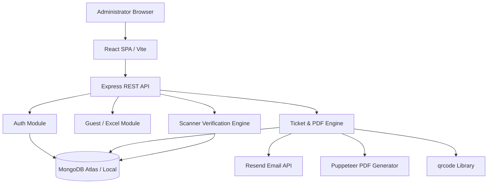

# Architecture Overview — QR Ticket Generation & Email Delivery System

## System Design
The application is structured as a **Modular Monolith** pairing a Node.js/Express TypeScript API with a React 18 / Vite TypeScript SPA.

## Security & Environment Management
- Environment variables are isolated by component (`server/` vs `client/`).
- `server/src/config/env.ts` validates required variables on server startup and prevents missing configuration bugs in production.
- Secrets (`JWT_SECRET`, `RESEND_API_KEY`, `MONGODB_URI`) are strictly excluded from repository tracking via `.gitignore`.
