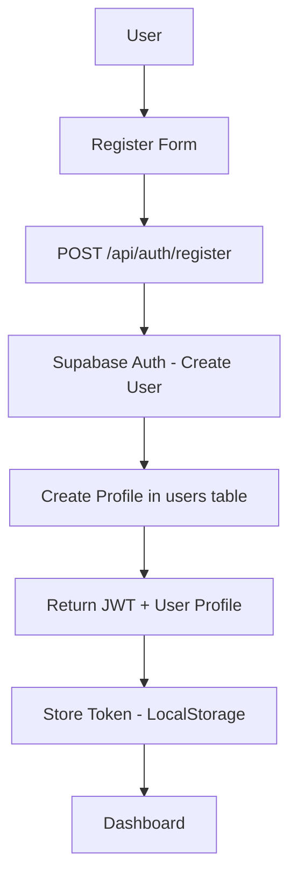
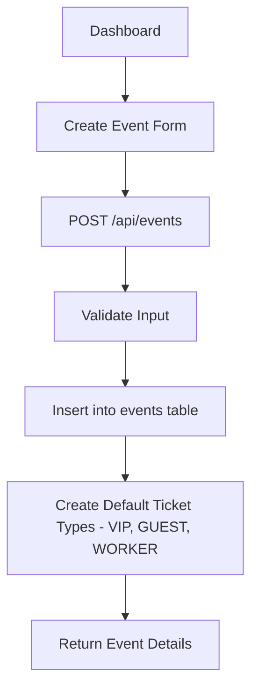
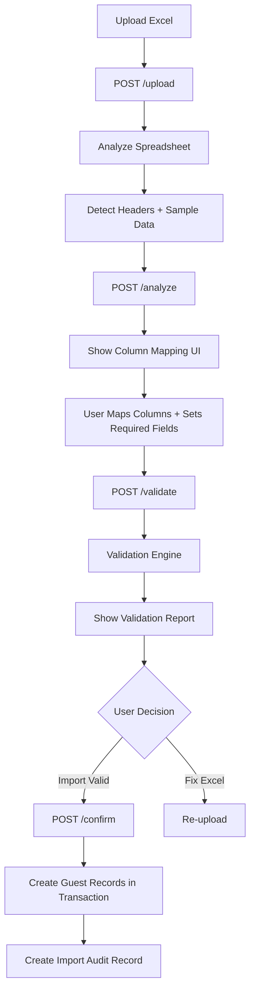
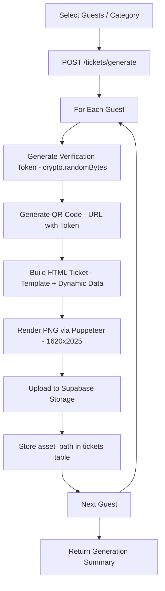
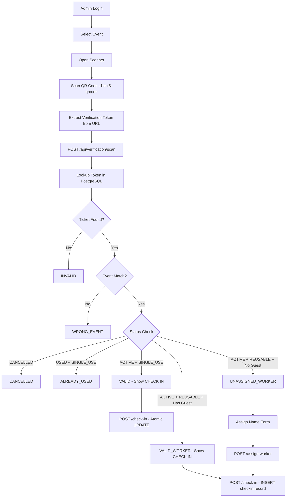
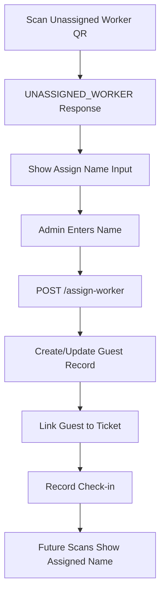

# Data Flow Specifications

## 1. Registration & Authentication Flow

## 2. Event Creation Flow

## 3. Smart Guest Import Flow

## 4. Ticket Generation Flow

## 5. Event-Day QR Scanner Check-in Flow

## 6. Worker Assignment Flow

