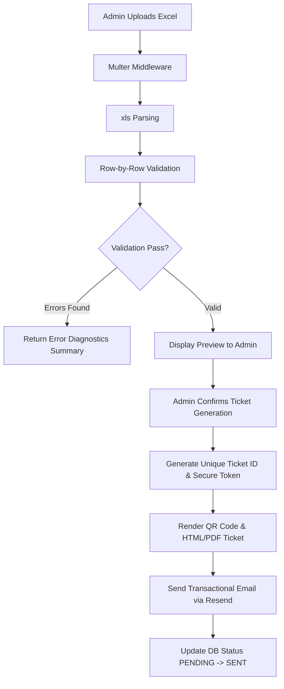
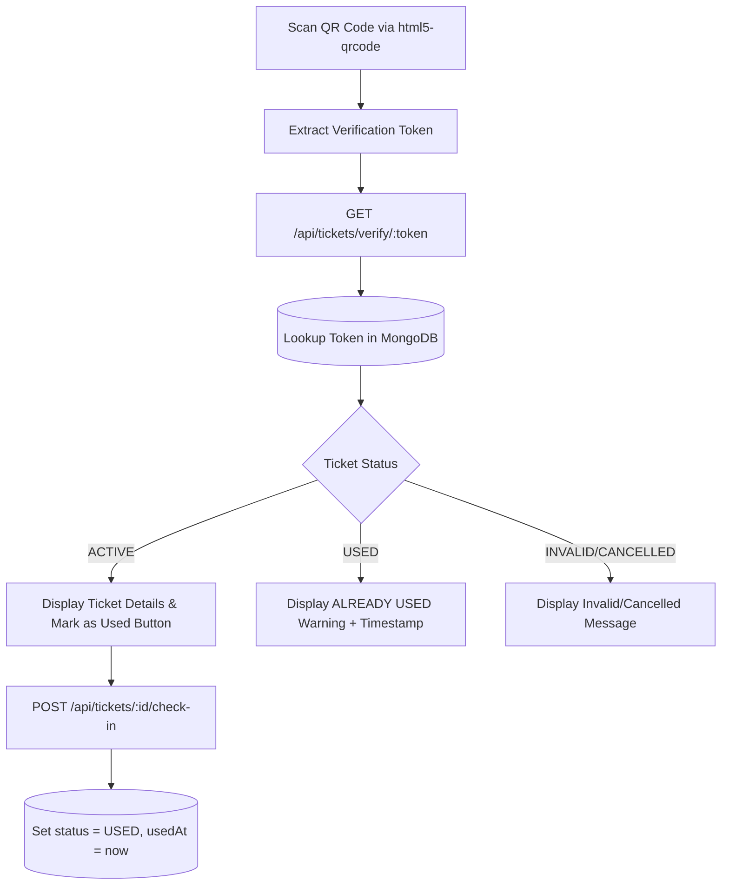

# Data Flow Specifications

## 1. Excel Import & Ticket Generation Flow

```mermaid
flowchart TD
    A[Admin Uploads Excel] --> B[Multer Middleware]
    B --> C[xls Parsing]
    C --> D[Row-by-Row Validation]
    D --> E{Validation Pass?}
    E -->|Errors Found| F[Return Error Diagnostics Summary]
    E -->|Valid| G[Display Preview to Admin]
    G --> H[Admin Confirms Ticket Generation]
    H --> I[Generate Unique Ticket ID & Secure Token]
    I --> J[Render QR Code & HTML/PDF Ticket]
    J --> K[Send Transactional Email via Resend]
    K --> L[Update DB Status PENDING -> SENT]
```

## 2. Event-Day QR Scanner Check-in Flow

```mermaid
flowchart TD
    Scan[Scan QR Code via html5-qrcode] --> Token[Extract Verification Token]
    Token --> BackendReq[GET /api/tickets/verify/:token]
    BackendReq --> QueryDB[(Lookup Token in MongoDB)]
    QueryDB --> StatusCheck{Ticket Status}
    StatusCheck -->|ACTIVE| Valid[Display Ticket Details & Mark as Used Button]
    StatusCheck -->|USED| AlreadyUsed[Display ALREADY USED Warning + Timestamp]
    StatusCheck -->|INVALID/CANCELLED| ErrorState[Display Invalid/Cancelled Message]
    
    Valid --> CheckIn[POST /api/tickets/:id/check-in]
    CheckIn --> MutateDB[(Set status = USED, usedAt = now)]
```
