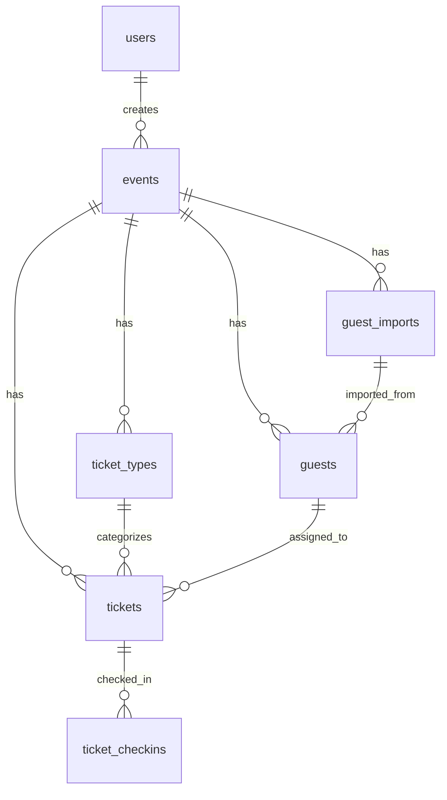

# Database Schema — Supabase PostgreSQL + Drizzle ORM

## Critical Rule
**ALL order-sensitive queries MUST use explicit `ORDER BY`.** Never rely on implicit database ordering.

## Schema Overview



## Tables

### users
Linked to Supabase Auth `auth.users` table.

| Column | Type | Constraints |
|---|---|---|
| id | UUID | PK, FK → auth.users(id) ON DELETE CASCADE |
| name | TEXT | NOT NULL |
| email | TEXT | NOT NULL, UNIQUE |
| role | TEXT | NOT NULL, DEFAULT 'ADMIN', CHECK IN ('ADMIN', 'ORGANIZER') |
| created_at | TIMESTAMPTZ | NOT NULL, DEFAULT now() |
| updated_at | TIMESTAMPTZ | NOT NULL, DEFAULT now() |

### events

| Column | Type | Constraints |
|---|---|---|
| id | UUID | PK, DEFAULT gen_random_uuid() |
| name | TEXT | NOT NULL |
| date | DATE | NOT NULL |
| time | TIME | nullable |
| venue | TEXT | nullable |
| description | TEXT | nullable |
| organizer_name | TEXT | nullable |
| logo_url | TEXT | nullable |
| ticket_template_url | TEXT | nullable |
| status | TEXT | NOT NULL, DEFAULT 'UPCOMING', CHECK IN ('UPCOMING','ONGOING','COMPLETED','CANCELLED') |
| created_by | UUID | NOT NULL, FK → users(id) ON DELETE CASCADE |
| created_at | TIMESTAMPTZ | NOT NULL, DEFAULT now() |
| updated_at | TIMESTAMPTZ | NOT NULL, DEFAULT now() |

**Indexes**: `created_by`, `status`

### ticket_types

| Column | Type | Constraints |
|---|---|---|
| id | UUID | PK, DEFAULT gen_random_uuid() |
| event_id | UUID | NOT NULL, FK → events(id) ON DELETE CASCADE |
| name | TEXT | NOT NULL (e.g., 'VIP', 'GUEST', 'WORKER') |
| label | TEXT | NOT NULL (display label) |
| usage_policy | TEXT | NOT NULL, DEFAULT 'SINGLE_USE', CHECK IN ('SINGLE_USE','REUSABLE') |
| created_at | TIMESTAMPTZ | NOT NULL, DEFAULT now() |

**Unique**: (event_id, name)
**Indexes**: `event_id`

### guests

| Column | Type | Constraints |
|---|---|---|
| id | UUID | PK, DEFAULT gen_random_uuid() |
| event_id | UUID | NOT NULL, FK → events(id) ON DELETE CASCADE |
| name | TEXT | nullable (unassigned workers) |
| email | TEXT | nullable |
| phone | TEXT | nullable |
| organization | TEXT | nullable |
| designation | TEXT | nullable |
| category | TEXT | NOT NULL (maps to ticket_types.name) |
| metadata | JSONB | DEFAULT '{}' |
| import_id | UUID | nullable, FK → guest_imports(id) |
| created_at | TIMESTAMPTZ | NOT NULL, DEFAULT now() |
| updated_at | TIMESTAMPTZ | NOT NULL, DEFAULT now() |

**Indexes**: `event_id`, `import_id`

### tickets

| Column | Type | Constraints |
|---|---|---|
| id | UUID | PK, DEFAULT gen_random_uuid() |
| event_id | UUID | NOT NULL, FK → events(id) ON DELETE CASCADE |
| guest_id | UUID | nullable, FK → guests(id) ON DELETE SET NULL |
| ticket_type_id | UUID | NOT NULL, FK → ticket_types(id) |
| verification_token | TEXT | NOT NULL, UNIQUE |
| status | TEXT | NOT NULL, DEFAULT 'ACTIVE', CHECK IN ('ACTIVE','USED','CANCELLED') |
| usage_policy | TEXT | NOT NULL, DEFAULT 'SINGLE_USE', CHECK IN ('SINGLE_USE','REUSABLE') |
| asset_path | TEXT | nullable (Supabase Storage path) |
| asset_url | TEXT | nullable (public/signed URL) |
| sequence_number | INTEGER | NOT NULL |
| created_by | UUID | NOT NULL, FK → users(id) |
| created_at | TIMESTAMPTZ | NOT NULL, DEFAULT now() |
| updated_at | TIMESTAMPTZ | NOT NULL, DEFAULT now() |

**Unique**: (event_id, sequence_number), verification_token
**Indexes**: `event_id`, `verification_token`, `guest_id`, `status`

### ticket_checkins

| Column | Type | Constraints |
|---|---|---|
| id | UUID | PK, DEFAULT gen_random_uuid() |
| ticket_id | UUID | NOT NULL, FK → tickets(id) ON DELETE CASCADE |
| event_id | UUID | NOT NULL, FK → events(id) ON DELETE CASCADE |
| checked_in_at | TIMESTAMPTZ | NOT NULL, DEFAULT now() |
| verified_by | TEXT | NOT NULL, DEFAULT 'Admin Scanner' |
| worker_name_assigned | TEXT | nullable |
| metadata | JSONB | DEFAULT '{}' |

**Indexes**: `ticket_id`, `event_id`, `checked_in_at`

### guest_imports

| Column | Type | Constraints |
|---|---|---|
| id | UUID | PK, DEFAULT gen_random_uuid() |
| event_id | UUID | NOT NULL, FK → events(id) ON DELETE CASCADE |
| file_name | TEXT | NOT NULL |
| total_rows | INTEGER | NOT NULL, DEFAULT 0 |
| valid_rows | INTEGER | NOT NULL, DEFAULT 0 |
| invalid_rows | INTEGER | NOT NULL, DEFAULT 0 |
| skipped_rows | INTEGER | NOT NULL, DEFAULT 0 |
| column_mapping | JSONB | NOT NULL, DEFAULT '{}' |
| required_fields | JSONB | NOT NULL, DEFAULT '[]' |
| category_mapping | JSONB | NOT NULL, DEFAULT '{}' |
| status | TEXT | NOT NULL, DEFAULT 'ANALYZING', CHECK IN ('ANALYZING','READY','IMPORTING','COMPLETED','COMPLETED_WITH_ERRORS','FAILED') |
| error_report | JSONB | DEFAULT '[]' |
| created_by | UUID | NOT NULL, FK → users(id) |
| created_at | TIMESTAMPTZ | NOT NULL, DEFAULT now() |

**Indexes**: `event_id`

## Query Discipline

Every repository method that returns lists MUST include ORDER BY:

```typescript
// ✅ Correct
const events = await db.select().from(eventsTable)
  .where(eq(eventsTable.createdBy, userId))
  .orderBy(desc(eventsTable.createdAt));

// ❌ NEVER do this
const events = await db.select().from(eventsTable)
  .where(eq(eventsTable.createdBy, userId));
// Missing ORDER BY — results are non-deterministic
```
